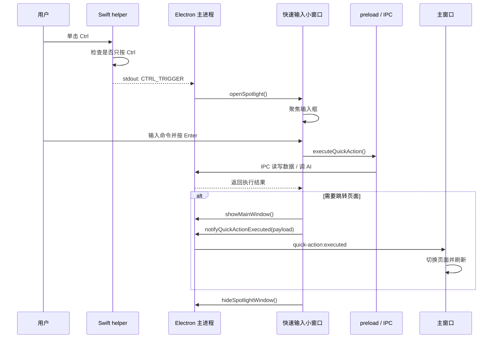

# 快捷键唤醒实现说明

本文档记录刻迹 KeTrace 当前“快捷键唤醒快速输入框”的真实实现逻辑、代码位置、运行流程和排错点。

## 当前结论

当前 macOS 端的唤醒逻辑是：**单击 Ctrl 键唤出独立快速输入小窗口**。

虽然原生辅助程序文件仍叫 `DoubleCtrlMonitor.swift`，但现在代码已经不是“双击 Ctrl”逻辑，而是监听一次 Ctrl 按下和松开。当用户只按 Ctrl、没有同时按 Shift / Option / Command 时，松开 Ctrl 就触发快速输入框。

Windows / 非 macOS 端目前没有原生全局监听 helper。非 macOS 只在主窗口前台时，通过 Electron 的 `before-input-event` 监听 Ctrl 松开，然后打开快速输入框。

## 相关文件

- `native/macos/DoubleCtrlMonitor.swift`
  - macOS 原生键盘监听 helper。
  - 使用 `CGEventTap` 监听全局 `flagsChanged` 事件。
  - 负责判断 Ctrl 是否被单独按下并释放。

- `scripts/build-native.mjs`
  - 构建时用 `swiftc` 把 Swift helper 编译到 `out/native/DoubleCtrlMonitor`。

- `src/main/nativeShortcut.ts`
  - Electron 主进程启动、停止、重启 Swift helper。
  - 读取 helper stdout 中的状态消息。
  - 收到 `CTRL_TRIGGER` 后调用 `openSpotlight()`。

- `src/main/window.ts`
  - 创建主窗口。
  - 创建快速输入小窗口。
  - 控制快速输入窗口定位、置顶、聚焦、失焦隐藏。

- `src/main/ipc.ts`
  - 注册 `spotlight:open`、`spotlight:hide`、`shortcut:status`、`shortcut:restart`、`quick-action:executed` 等 IPC。

- `src/preload/index.ts`
  - 把快捷键状态、打开/隐藏快速输入、通知主窗口等能力暴露给前端。

- `src/renderer/src/App.tsx`
  - 判断 URL 是否带 `?spotlight=1`。
  - 如果是快速输入小窗口，只渲染 `SpotlightCommand`。
  - 主窗口监听 `quick-action:executed`，按执行结果切换页面和刷新数据。

- `src/renderer/src/components/SpotlightCommand.tsx`
  - 快速输入框 UI。
  - 输入自然语言命令。
  - Enter 后执行 `executeQuickAction()`。
  - 执行成功后隐藏小窗口，并通知主窗口刷新。

- `src/renderer/src/quickActions.ts`
  - 快速输入命令解析与执行。
  - 支持任务、项目、论文、投稿、报告、页面跳转、备份等命令。

## 启动流程

应用启动后，主进程会执行：

1. `app.whenReady()`
2. `registerIpcHandlers()`
3. `createMainWindow()`
4. `startNativeShortcutMonitor()`
5. `setupTray()`
6. 如配置开启采集，则启动活动采集

其中快捷键监听是在 `src/main/main.ts` 中启动：

```ts
createMainWindow();
startNativeShortcutMonitor();
```

`startNativeShortcutMonitor()` 只在 macOS 生效。它会查找 helper 路径：

- 开发环境：`out/native/DoubleCtrlMonitor`
- 打包环境：`process.resourcesPath/native/DoubleCtrlMonitor`

如果 helper 不存在，状态会变成 `helperMissing: true`。

## macOS 全局监听流程

### 1. 原生 helper 申请监听条件

`native/macos/DoubleCtrlMonitor.swift` 启动后先检查两个权限：

```swift
let hasAccessibility = AXIsProcessTrusted()
let hasInputMonitoring = CGPreflightListenEventAccess()
```

如果缺少辅助功能权限，输出：

```text
ACCESSIBILITY_REQUIRED
```

如果缺少输入监控权限，输出：

```text
INPUT_MONITORING_REQUIRED
```

缺少任一权限时 helper 会退出。

### 2. 监听 Ctrl 键事件

helper 使用 `CGEvent.tapCreate` 建立全局事件监听：

```swift
eventsOfInterest: CGEventMask(1 << CGEventType.flagsChanged.rawValue)
```

它只关心两个 Ctrl 键码：

```swift
let ctrlKeyCodes: Set<Int64> = [59, 62]
```

含义是左 Ctrl 和右 Ctrl。

### 3. 判断是否只按了 Ctrl

当前判断逻辑是：

```swift
func hasOnlyCtrlReleased(_ flags: CGEventFlags) -> Bool {
  let blocked: CGEventFlags = [.maskShift, .maskAlternate, .maskCommand]
  return flags.intersection(blocked).isEmpty
}
```

也就是说，只要没有 Shift / Option / Command，就允许 Ctrl 触发。

### 4. 单击 Ctrl 触发

当 Ctrl 按下时：

```swift
ctrlIsDown = hasOnlyCtrlReleased(flags)
```

当 Ctrl 松开时，如果之前是单独 Ctrl 按下，就输出：

```text
CTRL_TRIGGER
```

主进程收到后打开快速输入框。

## 主进程接收触发

`src/main/nativeShortcut.ts` 使用 `spawn()` 启动 Swift helper：

```ts
const child = spawn(path, [], { stdio: ["ignore", "pipe", "pipe"] });
```

然后监听 stdout。

关键消息：

- `READY`：helper 已启动
- `CTRL_EVENT`：检测到 Ctrl 事件
- `CTRL_TRIGGER`：触发唤醒
- `ACCESSIBILITY_REQUIRED`：缺辅助功能权限
- `INPUT_MONITORING_REQUIRED`：缺输入监控权限
- `EVENT_TAP_FAILED`：事件监听创建失败
- `TAP_DISABLED`：事件监听被系统临时禁用

收到 `CTRL_TRIGGER` 后执行：

```ts
openSpotlight();
```

同时更新状态：

```ts
triggeredCount += 1
lastTriggeredAt = 当前时间
lastMessage = "triggered"
```

这些状态会显示在设置页的快捷键监听区。

## 快速输入小窗口打开流程

`openSpotlight()` 位于 `src/main/window.ts`。

流程如下：

1. 如果小窗口不存在，创建一个新的 `BrowserWindow`
2. 根据鼠标所在屏幕定位窗口
3. 调用 `app.focus({ steal: true })`
4. 显示窗口
5. 置顶
6. 聚焦窗口
7. 给窗口发送 `spotlight-window:focus` 事件

小窗口参数：

```ts
width: Math.min(720, Math.round(sw * 0.72))
height: 76
frame: false
skipTaskbar: true
alwaysOnTop: true
transparent: true
resizable: false
```

macOS 下还会设置：

```ts
setVisibleOnAllWorkspaces(true, { visibleOnFullScreen: true })
```

这让输入框可以出现在不同桌面和全屏空间上。

## 小窗口关闭逻辑

快速输入小窗口会在这些情况下关闭：

1. 小窗口失焦
2. 按 Escape
3. 点击输入框外层区域
4. 命令执行成功后延迟约 260ms 自动关闭

主进程层面的失焦关闭：

```ts
spotlightWindow.on("blur", () => {
  spotlightWindow?.hide();
});
```

前端层面的失焦关闭：

```ts
window.addEventListener("blur", handler);
```

## 快速输入执行流程

小窗口渲染的是 `SpotlightCommand`。

用户输入内容后按 Enter：

1. `SpotlightCommand.submit()`
2. 调用 `executeQuickAction(input)`
3. `quickActions.ts` 判断命令类型
4. 根据命令调用 `window.rijiAPI.*`
5. `preload` 转发 IPC 到主进程
6. 主进程读写本地数据或调用 AI
7. 返回执行结果

如果结果里有 `navigate`，小窗口会调用：

```ts
window.rijiAPI.showMainWindow()
```

然后成功时调用：

```ts
window.rijiAPI.notifyQuickActionExecuted({
  navigate: res.navigate,
  message: res.message
});
```

主进程收到 `quick-action:executed` 后：

```ts
notifyMainWindow(payload)
```

`notifyMainWindow()` 会：

1. 显示主窗口
2. 聚焦主窗口
3. 向主窗口发送 `quick-action:executed`

主窗口 `App.tsx` 收到后：

1. 如果 payload 里有 `navigate`，切换到对应页面
2. 刷新页面 key
3. 当前页面重新读取数据

## 整体时序



## 设置页状态来源

设置页调用：

```ts
window.rijiAPI.shortcutStatus()
```

对应主进程：

```ts
ipcMain.handle("shortcut:status", () => {
  return getNativeShortcutStatus();
});
```

返回字段包括：

- `supported`：当前平台是否支持原生全局监听
- `running`：helper 是否在运行
- `accessibilityRequired`：是否缺辅助功能权限
- `inputMonitoringRequired`：是否缺输入监控权限
- `eventTapFailed`：事件监听是否创建失败
- `helperMissing`：helper 文件是否不存在
- `triggeredCount`：触发次数
- `lastTriggeredAt`：最近触发时间
- `ctrlEventCount`：检测到 Ctrl 事件次数
- `lastCtrlEventAt`：最近检测到 Ctrl 的时间
- `ready`：helper 是否输出 READY
- `tapDisabled`：事件监听是否被系统禁用过
- `lastMessage`：最后状态消息

## 目前的限制和风险

1. 文件名仍叫 `DoubleCtrlMonitor.swift`，但实际是单击 Ctrl 触发，命名和行为不一致。

2. 单击 Ctrl 属于比较激进的全局触发方式，可能和其他 App 或系统行为冲突。

3. macOS 权限与签名强相关。开发模式下 helper 每次重新构建后，系统可能把它视为新的可执行文件，导致辅助功能或输入监控权限需要重新授权。

4. 当前 helper 缺权限时会直接退出。用户授权后需要点击“重启监听”或重启 App。

5. 如果 Dock 或菜单栏还在后台，但 helper 挂掉，主界面仍可能正常运行，只是 Ctrl 无法唤醒。

6. `CGEventTap` 被系统禁用时，代码会尝试重新启用，但如果底层权限或系统策略失败，仍可能无法继续监听。

7. 非 macOS 当前没有真正的全局快捷键监听，只能在主窗口前台时捕获 Ctrl。

## 常见问题排查

### 单击 Ctrl 没反应

先看设置页快捷键监听区：

- 如果显示 `需要辅助功能权限`：到系统设置里给刻迹、Electron 或 `DoubleCtrlMonitor` 开启辅助功能。
- 如果显示 `需要输入监控权限`：到系统设置里开启输入监控。
- 如果显示 `helper missing`：说明 `out/native/DoubleCtrlMonitor` 没构建出来，需要重新运行构建。
- 如果 `Ctrl` 事件时间会更新，但触发时间不更新：说明 helper 能收到键盘事件，但判断没有进入触发条件，通常是同时按了其他修饰键或事件被系统截断。
- 如果 `ready` 为 false：helper 没有成功进入监听循环。

### 权限开了还是提示

开发模式下 helper 路径是构建产物：

```text
out/native/DoubleCtrlMonitor
```

每次重新构建后，macOS 可能重新识别这个二进制。更稳定的方式是使用打包后的 App，并给打包 App 授权。

### 小窗口出现但主界面没有更新

快速输入小窗口执行成功后，会通过 `quick-action:executed` 通知主窗口。如果小窗口命令没有返回 `navigate`，主窗口可能只刷新但不切换页面。

检查点：

- `SpotlightCommand.submit()`
- `executeQuickAction()` 返回的 `navigate`
- `window.rijiAPI.notifyQuickActionExecuted()`
- `src/main/ipc.ts` 的 `quick-action:executed`
- `App.tsx` 的 `onQuickActionExecuted`

## 后续建议

1. 如果产品上仍想要“双击 Ctrl”，应把 Swift helper 改回双击判断：记录两次 Ctrl 松开的时间戳，在 300ms 左右窗口内才输出 `CTRL_TRIGGER`。

2. 如果继续使用“单击 Ctrl”，建议把文件和 UI 文案统一改名为 `CtrlMonitor` / “单击 Ctrl”，避免后期维护误解。

3. 打包后应优先验证授权稳定性，因为开发环境的 helper 权限最容易反复失效。

4. 可以在设置页增加更明确的状态展示：helper 路径、最近 stdout 消息、最近退出码，方便判断到底是权限问题还是二进制问题。
